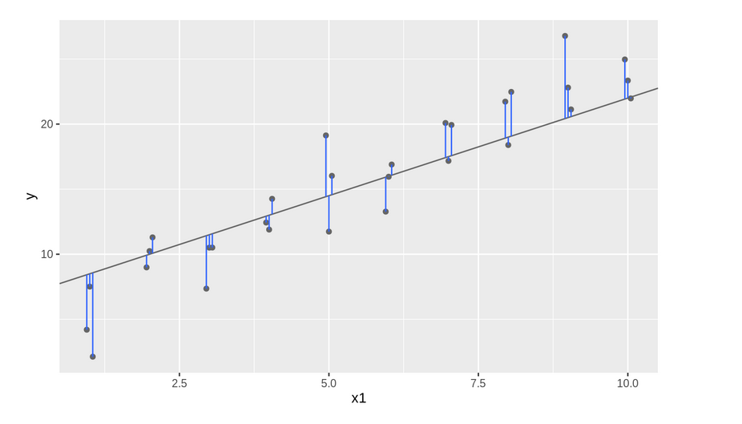

---
output:
  xaringan::moon_reader:
    lib_dir: libs
    css:  ["default", "default-fonts", "animate.css",  "hygge"]
    nature:
      highlightStyle: github
      highlightLines: true
      highlightSpans: true
      countIncrementalSlides: true
---
class: inverse, center
```{r , message=FALSE, warning=FALSE, include=FALSE} 
library(fontawesome)
library(emo)
```

# `r fa("r-project", fill = 'steelblue')` Preparación Certificación RStudio  `r emo::ji("rocket")`<br> <br> 

## `r emo::ji("wrench")`Modelos Capítulo 23 `r emo::ji("computer")` 
<br> <br> <br> 

.large[Roxana N. Villafañe <a href='http://twitter.com/data_datum'>`r fa("twitter", fill = 'steelblue')` @data_datum</a>] <br> 


`r emo::ji("sparkles")`
<br> Link <https://data-datum.github.io/models/models/23-pres.html#1> `r emo::ji("star2")`

---

background-image: url(img/text-msg.png)
background-size: cover
class: center, middle

# Generalidades del tema


---

background-image: url(img/fondo-madera.png)
background-size: cover
class: center, middle


## El objetivo de un modelo es 
## proveer un resumen de baja dimensión 
## de un conjunto de datos

    


---

# Prerrequisitos

En este capítulo usaremos el paquete modelr que tiene las funciones de modelado de R base para que funcionen naturalmente en un pipe.

```{r message=FALSE, warning=FALSE}
library(tidyverse)

library(modelr)
options(na.action = na.warn)
```

---

## Un modelo simple

Miremos el conjunto de datos simulado sim1, incluído dentro del paquete modelr. Este contiene dos variables continuas, x e y. Grafiquémoslas para ver como están relacionadas:

```{r fig.height=5}
ggplot(sim1, aes(x, y)) +
  geom_point()
```


---

# Un mal modelo

Se sobreentiende que un buen modelo es aquel que está "cerca" de los datos

```{r eval=TRUE, echo=FALSE, fig.height=6}
modelos <- tibble(
  a1 = runif(250, -20, 40),
  a2 = runif(250, -5, 5)
)

ggplot(sim1, aes(x, y)) +
  geom_abline(aes(intercept = a1, slope = a2), data = modelos, alpha = 1 / 4) +
  geom_point()
```

---

# Un buen modelo




---

background-image: url(img/fondo-madera.png)
background-size: cover
class: center, middle

## Hay dos partes en un modelo:

### 1. Definir una familia de modelos que expresa un patrón que se quiere capturar. Debe ser preciso y genérico. Ej; una línea recta o curva cuadrática 
### 2. Generar un modelo ajustado al encontrar un modelo de la familia que sea lo más cercano a tus datos. 


---

background-image: url(img/fondo-madera.png)
background-size: cover
class: center, middle

## Un lugar fácil para comenzar es encontrar la distancia vertical entre cada punto y el modelo.
## La distancia es solo la diferencia entre el valor dado por el modelo (la predicción), y el valor real y en los datos (la respuesta).

---

# Primer paso

### Para calcular esta distancia, 
### transformamos nuestra familia de modelos en una función de R. Esta función toma los parámetros del modelo y los datos como inputs, y retorna el valor predicho por el modelo como output:

```{r}
model1 <- function(a, data) {
  a[1] + data$x * a[2]
}
model1(c(7, 1.5), sim1)
```

---
# Distancia entre lo predicho y los valores reales. 

¿Cómo las colapsamos en un único número?

En estadística se usa la __“raíz del error cuadrático medio” (RMSE o root-mean-squared deviation).__

Calculamos la diferencia entre los valores reales y los predichos, los elevamos al cuadrado, luego se promedian y tomamos la raíz cuadrada. 

```{r}
measure_distance <- function(mod, data) {
  diff <- data$y - model1(mod, data)
  sqrt(mean(diff^2))
}
measure_distance(c(7, 1.5), sim1)
```

---
## Purrr
Calcular la distancia de todos los modelos definidos anteriormente. 
Necesitamos una función auxiliar debido a que nuestra función de distancia espera que el modelo sea un vector numérico de longitud 2.

```{r}
sim1_dist <- function(a1, a2) {
  measure_distance(c(a1, a2), sim1)
}

modelos <- modelos %>%
  mutate(dist = purrr::map2_dbl(a1, a2, sim1_dist))
modelos
```

---
### 10 mejores modelos

He coloreado los modelos usando -dist: esto es una forma fácil de asegurarse de que los mejores modelos (es decir, aquellos con la menor distancia) tengan los colores más brillantes.

```{r fig.height=4}
ggplot(sim1, aes(x, y)) +
  geom_point(size = 2, colour = "grey30") +
  geom_abline(
    aes(intercept = a1, slope = a2, colour = -dist),
    data = filter(modelos, rank(dist) <= 10)
  )
```


---

## Usando una grilla (1)

```{r fig.height=6}
ggplot(modelos, aes(a1, a2)) +
  geom_point(data = filter(modelos, rank(dist) <= 10), size = 4, colour = "red") +
  geom_point(aes(colour = -dist))
```

---
## Usando una grilla (2)
```{r echo=FALSE}
grid <- expand.grid(
  a1 = seq(-5, 20, length = 25),
  a2 = seq(1, 3, length = 25)
) %>%
  mutate(dist = purrr::map2_dbl(a1, a2, sim1_dist))

grid %>%
  ggplot(aes(a1, a2)) +
  geom_point(data = filter(grid, rank(dist) <= 10), size = 4, colour = "red") +
  geom_point(aes(colour = -dist))
```

---
Cuando superpones los mejores 10 modelos en los datos originales, se ven bastante bien:

```{r fig.height=4}
ggplot(sim1, aes(x, y)) +
  geom_point(size = 2, colour = "grey30") +
  geom_abline(
    aes(intercept = a1, slope = a2, colour = -dist),
    data = filter(grid, rank(dist) <= 10))
```

---

### Conclusión

De forma iterativa se puede hacer la cuadrícula más y más fina hasta reducir los resultados al mejor modelo.

_Existe una forma mejor de resolver el problema:_ una herramienta de minimización llamada __búsqueda de Newton-Raphson__. La intuición detrás de Newton-Raphson es bastante simple: tomas un punto de partida y buscas la pendiente más fuerte en torno a ese punto. Puedes bajar por esa pendiente un poco, para luego repetir el proceso varias veces, hasta que no se puede descender más. __En R, esto se puede hacer con la función optim():__

```{r}
best <- optim(c(0, 0), measure_distance, data = sim1)
best$par
```

---

```{r}
ggplot(sim1, aes(x, y)) +
  geom_point(size = 2, colour = "grey30") +
  geom_abline(intercept = best$par[1], slope = best$par[2])
```

---

No te preocupes demasiado acerca de los detalles de cómo funciona optim(). La intuición es lo importante. Si tienes una función que define la mínima distancia entre un modelo y un conjunto de datos, un algoritmo que pueda minimizar la distancia modificando los parámetros del modelo te permitirá encontrar el mejor modelo. Lo interesante de este enfoque es que funciona con cualquier familia de modelos respecto de la cual se pueda escribir una ecuación que los describa.

Existe otro enfoque que podemos usar para este modelo, debido a que es un caso especial de una familia más amplia: los modelos lineales. Un modelo lineal es de la forma y = a_1 + a_2 * x_1 + a_3 * x_2 + ... + a_n * x_(n+1). Este modelo simple es equivalente a un modelo lineal generalizado en el que n tiene valor 2 y x_1 es x. R cuenta con una herramienta diseñada especialmente para ajustar modelos lineales llamada lm(). lm() tiene un modo especial de especificar la familia del modelo: las fórmulas. Las fórmulas son similares a y ~ x, que lm() traducirá a una función de la forma y = a_1 + a_2 * x. Podemos ajustar el modelo y mirar la salida:

---
# Usando la función lm

```{r}
sim1_mod <- lm(y ~ x, data = sim1)
coef(sim1_mod)
```

---

## Visualizando modelos

```{r}
grid <- sim1 %>%
  data_grid(x)
grid
```


---

```{r}
grid <- grid %>%
  add_predictions(sim1_mod)
grid
```

---
A continuación, graficamos las predicciones. Te preguntarás acerca de todo este trabajo adicional en comparación a usar geom_abline(). Pero la ventaja de este enfoque es que funciona con cualquier modelo en R, desde los más simples a los más complejos. La única limitante son tus habilidades de visualización. Para más ideas respecto de como visualizar modelos complejos, puedes consultar http://vita.had.co.nz/papers/model-vis.html.

```{r fig.height=5}
ggplot(sim1, aes(x)) +
  geom_point(aes(y = y)) +
  geom_line(aes(y = pred), data = grid, colour = "red", size = 1)
```

---

background-image: url(img/fondo-madera.png)
background-size: cover
class: center, middle

## Residuos

## Las predicciones te informan de los patrones que el modelo captura y los residuos te dicen lo que el modelo ignora. 
## Los residuos son las distancias entre lo observado y los valores predichos que calculamos anteriormente.


---

## add_residuals()
Notar que usamos __el data frame original y no no una grilla manufacturada.__´ Esto es porque para calcular los residuos se necesitan los valores de “y”.


```{r}
sim1 <- sim1 %>%
  add_residuals(sim1_mod)
sim1
```

---
## Polígono de frecuencias

Existen diferentes formas de entender qué nos dicen los residuos respecto del modelo. Una forma es dibujar un polígono de frecuencia que nos ayude a entender cómo se propagan los residuos:

```{r fig.height=4}
ggplot(sim1, aes(resid)) +
  geom_freqpoly(binwidth = 0.5)
```

---

Esto ayuda a calibrar la __calidad del modelo:__ ¿qué tan lejos se encuentran las predicciones de los valores observados? Nota que el promedio del residuo es siempre cero.

A menudo vas a querer crear gráficos usando los residuos en lugar del predictor original. Verás mucho de eso en el capítulo siguiente:

```{r fig.height=4}
ggplot(sim1, aes(x, resid)) +
  geom_ref_line(h = 0) +
  geom_point()
```


---
background-image: url(img/fondo-madera.png)
background-size: cover
class: center, middle

## Esto parece ser ruido aleatorio, lo que sugiere que el modelo ha hecho un buen trabajo capturando los patrones del conjunto de datos.

---
background-image: url(img/text-msg.png)
background-size: cover
class: center, middle

## Fórmulas y familias de modelos

---


Ya habrás visto fórmulas anteriormente cuando usamos facet_wrap() y facet_grid(). En R, las fórmulas proveen un modo general de obtener “comportamientos especiales”. En lugar de evaluar los valores de las variables directamente, se capturan los valores para que sean interpretados por una función.

La mayoría de los las funciones de modelado en R usan una conversión estándar para las fórmulas y las funciones. Ya habrás visto una conversión simple y ~ x que se convierte en y = a_1 + a_2 * x. Si quieres ver lo que hace R, puedes usar la función model_matrix(). Esta toma un data frame y una fórmula para entregar un tibble que define la ecuación del modelo: cada columna en la salida está asociada con un coeficiente del modelo, la función es siempre y = a_1 * salida_1 + a_2 * salida_2. Para el caso simple y ~ x1 esto nos muestra algo interesante:

---

```{r}
df <- tribble(
  ~y, ~x1, ~x2,
  4, 2, 5,
  5, 1, 6
)
model_matrix(df, y ~ x1)

```

---

La forma en que R agrega el intercepto (u ordenada al origen) al modelo es mediante una columna de unos. Por defecto, R siempre agregará esta columna. Si no quieres esto, necesitas excluirla explícitamente usando -1:

```{r}
model_matrix(df, y ~ x1 - 1)
```

La matriz del modelo crece de manera nada sorprendente si incluyes más variables al modelo:

```{r}
model_matrix(df, y ~ x1 + x2)
```


---
Las siguientes secciones detallan cómo esta notación de fórmulas funciona con variables categóricas, interacciones y transformaciones.


---
background-image: url(img/text-msg.png)
background-size: cover
class: center, middle


# Variables categóricas


---


## Variables categóricas


Generar una función a partir de una fórmula es directo cuando el predictor es una variable continua, pero las cosas son más complicadas cuando el predictor es una variable categórica. Imagina que tienes una fórmula como y ~ sexo, donde el sexo puede ser hombre o mujer. No tiene sentido convertir a una fórmula del tipo y = x_0 + x_1 * sexo debido a que sexo no es un número - ¡no se puede multiplicar! En su lugar, lo que R hace es convertir a y = x_0 + x_1 * sexo_hombre donde sexo_hombre tiene valor 1 si sexo corresponde a hombre y cero a mujer:

---

```{r}
df <- tribble(
  ~genero, ~respuesta,
  "masculino", 1,
  "femenino", 2,
  "masculino", 1
)
model_matrix(df, respuesta ~ genero)
```

---

Quizá te preguntes por qué R no crea la columna generofemenino. El problema es que eso crearía una columna perfectamente predecible a partir de las otras columnas (es decir, generofemenino = 1 - generomasculino). Desafortunadamete los detalles exactos de por qué esto es un problema van más allá del alcance del libro, pero básicamente crea una familia de modelos que es muy flexible y genera infinitos modelos igualmente cercanos a los datos.

Afortunadamente, sin embargo, si te enfocas en visualizar las predicciones no necesitas preocuparte de la parametrización exacta. Veamos algunos datos y modelos para hacer algo concreto. Aquí está el dataset sim2 de modelr:

---

```{r}
ggplot(sim2) +
  geom_point(aes(x, y))
```

---

Podemos ajustar un modelo a esto y generar predicciones:

```{r}
mod2 <- lm(y ~ x, data = sim2)

grid <- sim2 %>%
  data_grid(x) %>%
  add_predictions(mod2)
grid
```

---

Efectivamente, un modelo con una variable x categórica va a predecir el valor medio para cada categoría. (¿Por qué? porque la media minimiza la raíz de la distancia media cuadrática.) Es fácil de ver si superponemos la predicción sobre los datos originales:

```{r fig.height=6}
ggplot(sim2, aes(x)) +
  geom_point(aes(y = y)) +
  geom_point(data = grid, aes(y = pred), colour = "red", size = 4)
```

---

No es posible hacer predicciones sobre niveles no observados. A veces harás esto por accidente, por lo que es bueno reconocer el siguiente mensaje de error:

```{r eval=FALSE}
tibble(x = "e") %>%
  add_predictions(mod2)
```

---

background-image: url(img/text-msg.png)
background-size: cover
class: center, middle


# Interacciones 
## (continuas y categóricas)

---


#### ¿Qué ocurre si combinas una variable continua y una categórica? sim3 contiene un predictor categórico y otro predictor continuo. Podemos visualizarlos con un gráfico simple:

```{r fig.height=6}
ggplot(sim3, aes(x1, y)) +
  geom_point(aes(colour = x2))
```

---

Existen dos posibles modelos que se pueden ajustar a estos datos:

```{r}
mod1 <- lm(y ~ x1 + x2, data = sim3)
mod2 <- lm(y ~ x1 * x2, data = sim3)
```

__Cuando agregas variables con + el modelo va a estimar cada efecto independientemente de los demás. Es posible agregar al ajuste lo que se conoce como interacción usando * . __

Por ejemplo, y ~ x1 * x2 se traduce en y = a_0 + a_1 * x_1 + a_2 * x_2 + a_12 * x_1 * x_2. Observa que si usas *, tanto el efecto interacción como los efectos individuales se incluyen en el modelo.

Para visualizar estos modelos necesitamos dos nuevos trucos:

1. Tenemos dos predictores, por lo que necesitamos pasar ambas variables a __data_grid()__. Esto encontrará todos los valores únicos de x1 y x2 y luego generará todas las combinaciones,

2. Para generar predicciones de ambos modelos simultáneamente, podemos usar __gather_predictions()__ que incorpora cada predicción como una fila. El complemento de __gather_predictions()__ es __spread_predictions()__ que incluye cada predicción en una nueva columna.

---

Esto combinado nos da:

```{r}
grid <- sim3 %>%
  data_grid(x1, x2) %>%
  gather_predictions(mod1, mod2)
grid
```

---

Podemos visualizar los resultados de ambos modelos en un gráfico usando separando en facetas:

```{r fig.height=6}
ggplot(sim3, aes(x1, y, colour = x2)) +
  geom_point() +
  geom_line(data = grid, aes(y = pred)) +
  facet_wrap(~model)
```

---
background-image: url(img/fondo-madera.png)
background-size: cover
class: center, middle

## Modelo con (+): misma pendiente pero distinta ordenada al origen.
## Modelo con (*): distinta pendiente y distinta ordenada al origen.

## ¿Qué modelo es el más adecuado? Miramos los residuos. 

---

```{r fig.height=6}
sim3 <- sim3 %>%
  gather_residuals(mod1, mod2)

ggplot(sim3, aes(x1, resid, colour = x2)) +
  geom_point() +
  facet_grid(model ~ x2)
```
  
---

background-image: url(img/fondo-madera.png)
background-size: cover
class: center, middle

## Conclusión

## Residuos de mod1 tienen patrones ignorados en b, y un poco menos ignorados en c y d. 
## Residuos de mod2, un patrón poco obvio
## ¿Existe una forma precisa de determinar si mod1 o mod2 es mejor? Sí, pero no la trataremos. 
## Nos interesa evaluar cualitativamente si el modelo ha capturado los patrones que nos interesan.


---

background-image: url(img/text-msg.png)
background-size: cover
class: center, middle


# Valores faltantes

---

## Valores faltantes


Los valores faltantes obviamente no proporcionan información respecto de la relación entre las variables, por lo que modelar funciones va a eliminar todas las filas con valores faltantes. R por defecto lo hace de forma silenciosa, pero options(na.action = na.warn) (ejecutado en los prerrequisitos) asegura que la salida incluya una advertencia.

```{r}
df <- tribble(
  ~x, ~y,
  1, 2.2,
  2, NA,
  3, 3.5,
  4, 8.3,
  NA, 10
)

mod <- lm(y ~ x, data = df)
```

---

Para suprimir los mensajes de advertencia, incluye na.action = na.exclude:

```{r}
mod <- lm(y ~ x, data = df, na.action = na.exclude)
```

Siempre puedes consultar cuántas observaciones se usaron con nobs():

```{r}
nobs(mod)
```

---
background-image: url(img/text-msg.png)
background-size: cover
class: center, middle


# Otras familias de modelos

---
#Otras familias de modelos(1)

Este capítulo se centró de forma exclusiva en la familia de modelos lineales, la cual asume una relación de la forma y = a_1 * x1 + a_2 * x2 + ... + a_n * xn. Además, los modelos lineales asumen que los residuos siguen una distribución normal, algo de lo que no hemos hablado. Existe un amplio conjunto de familias de modelos que extienden la familia de modelos lineales de varias formas interesantes. Algunos son:

* Modelos lineales generalizados, es decir, stats::glm(). Los modelos lineales asumen que la respuesta es una variable continua y que el error sigue una distribución normal. Los modelos lineales generalizados extienden los modelos lineales para incluir respuestas no continuas (es decir, datos binarios o conteos). Definen una distancia métrica basada en la idea estadística de verosimilitud.

* Modelos generalizados aditivos, es decir, mgcv::gam(), extienden los modelos lineales generalizados para incorporar funciones suaves arbitrarias. Esto significa que puedes escribir una fórmula del tipo y ~ s(x) que se transforma en una ecuación de la forma y = f(x) y dejar que gam() estime la función (sujeto a algunas restricciones de suavidad para que el problema sea manejable).


---
#Otras familias de modelos(2)

* Modelos lineales penalizados, es decir, glmnet::glmnet(), incorporan un término de penalización a la distancia y así penalizan modelos complejos (definidos por la distancia entre el vector de parámetros y el origen). Esto tiende a entregar modelos que generalizan mejor respecto de nuevos conjuntos de datos para la misma población.

* Modelos lineales robustos, es decir, MASS:rlm(), modifican la distancia para restar importancia a los puntos que quedan muy alejados. Esto resulta en modelos menos sensibles a valores extremos, con el inconveniente de que no son muy buenos cuando no hay valores extremos.
* Árboles, es decir, rpart::rpart(), atacan un problema de un modo totalmente distinto a los modelos lineales. Ajustan un modelo constante por partes, dividiendo los datos en partes progresivamente más y más pequeñas. Los árboles no son tremendamente efectivos por sí solos, pero son muy poderosos cuando se usan en modelos agregados como bosques aleatorios, del inglés random forests), (es decir, randomForest::randomForest()) o máquinas aceleradoras de gradiente, del inglés gradient boosting machines (es decir, xgboost::xgboost.).
