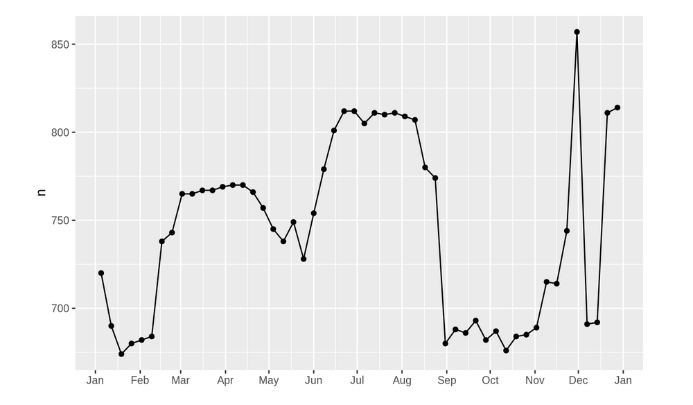
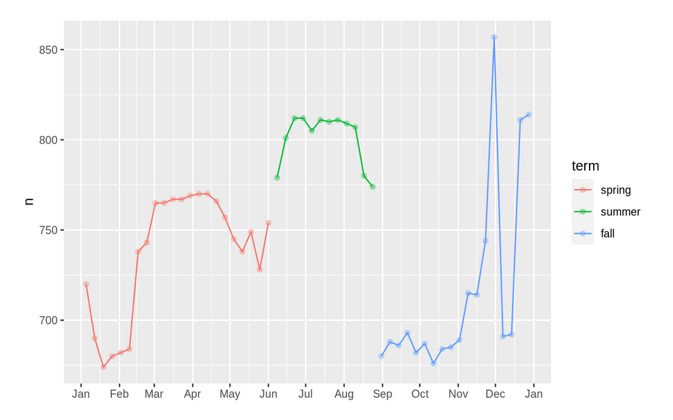

---
output:
  xaringan::moon_reader:
    lib_dir: libs
    css:  ["default", "default-fonts", "animate.css",  "hygge"]
    nature:
      highlightStyle: github
      highlightLines: true
      highlightSpans: true
      countIncrementalSlides: true
---
class: inverse, center
```{r , message=FALSE, warning=FALSE, include=FALSE} 
library(fontawesome)
library(emo)
```

# `r fa("r-project", fill = 'steelblue')` Preparación Certificación RStudio  `r emo::ji("rocket")`<br> <br> 

## `r emo::ji("wrench")`Modelos  `r emo::ji("computer")` 
<br> <br> <br> 

.large[Roxana N. Villafañe <a href='http://twitter.com/data_datum'>`r fa("twitter", fill = 'steelblue')` @data_datum</a>] <br> 


`r emo::ji("sparkles")`
<br> Link <> `r emo::ji("star2")`

---

## Introducción

En el capítulo previo aprendimos cómo funcionan los modelos lineales, y aprendimos algunas herramientas básicas para entender lo que un modelo está mostrando con sus datos. El capítulo previo se enfocó en simular conjunto de datos. Este capítulo se centrará en datos reales, mostrando como puedes progresivamente construir un modelo que te ayude a entender los datos.

---

## Prerrequisitos

Usaremos las mismas herramientas que en el capítulo anterior, pero agregaremos algunos conjuntos de datos reales: **diamantes** y **vuelos** del paquete datos También necesitaremos lubridate para trabajar con fechas/horas en vuelos.


```{r message=FALSE, warning=FALSE}
library(tidyverse)
library(modelr)
library(lubridate)
library(datos)
options(na.action = na.warn)
```

---

background-image: url(img/text-msg.png)
background-size: cover
class: center, middle

# ¿Por qué los diamantes 
# de baja calidad son más caros?

---

background-image: url(img/fondo-madera.png)
background-size: cover
class: center, middle


## En el capítulo anterior vimos una sorprendente relación entre

## calidad de los diamantes y su precio

## diamantes de baja calidad (cortes pobres, colores malos, y claridad inferior) tienen más altos precios.

---


```{r}
ggplot(diamantes, aes(corte, precio)) + geom_boxplot()
```

---

```{r}
ggplot(diamantes, aes(color, precio)) + geom_boxplot()
```

---

```{r}
ggplot(diamantes, aes(claridad, precio)) + geom_boxplot()
```

---

background-image: url(img/fondo-madera.png)
background-size: cover
class: center, middle


## Precio y quilates

## Pareciera que los diamantes de menor calidad tiene precios más altos porque hay una importante variable de confusión: el peso (carat) del diamante. 

## El peso del diamante es el factor individual más importante para determinar el precio del diamante, y los diamantes de menor calidad tienden a ser más grandes.

---

```{r}
ggplot(diamantes, aes(quilate, precio)) + 
  geom_hex(bins = 50)
```

---

# Hagamos algunos ajustes al conjunto de datos de diamantes 

### 1. Foco en los diamantes más pequeños que 2.5 quilates (99.7% de los datos).

### 2. Hacer una transformación logarítmica de las variables quilates y precio. 

```{r}
diamantes2 <- diamantes %>%
  filter(quilate <= 2.5) %>% 
  mutate(log_precio = log2(precio), log_quilates = log2(quilate))
```

---


```{r}
ggplot(diamantes2, aes(log_quilates, log_precio)) + 
  geom_hex(bins = 50)
```

---

La transformación logarítmica es particularmente util aquí porque hace que el patrón sea lineal, y patrones lineales son más fáciles de usar. Tomemos el próximo paso y eliminemos ese patron lineal fuerte. Primero hacemos explícito el patrón ajustando el modelo:

```{r}
mod_diamantes <- lm(log_precio ~ log_quilates, data = diamantes2)

```

Luego observamos lo que el modelo nos dice. Ten en cuenta que vuelvo atrás la transformación de la predicción, deshaciendo la transformación logarítmica, para poder superponer las predicciones sobre los datos originales:

---

```{r fig.height=5}
cuadricula <- diamantes2 %>% 
  data_grid(quilate = seq_range(quilate, 20)) %>% 
  mutate(log_quilates = log2(quilate)) %>% 
  add_predictions(mod_diamantes, "log_precio") %>% 
  mutate(precio = 2 ^ log_precio)

ggplot(diamantes2, aes(quilate, precio)) + 
  geom_hex(bins = 50) + 
  geom_line(data = cuadricula, colour = "red", size = 1)
```


---
background-image: url(img/fondo-madera.png)
background-size: cover
class: center, middle


## Si creemos en nuestro modelo, los diamantes grandes son mucho más baratos que lo esperado. Esto es posiblemente porque ninguno de los diamantes de estos datos cuesta más de US$19,000.

---

## Residuos
Esto comprueba que hemos eliminado el patrón lineal fuerte:

```{r fig.height=4}
diamantes2 <- diamantes2 %>% 
  add_residuals(mod_diamantes, "lresid")

ggplot(diamantes2, aes(log_quilates, lresid)) + 
  geom_hex(bins = 50)
```


---

Es importante destacar que ahora podemos volver a hacer nuestros gráficos motivadores utilizando esos residuos en lugar de precio.

```{r}
ggplot(diamantes2, aes(corte, lresid)) + geom_boxplot()
```

---

```{r}
ggplot(diamantes2, aes(color, lresid)) + geom_boxplot()
```


---
```{r}
ggplot(diamantes2, aes(claridad, lresid)) + geom_boxplot()
```

---

background-image: url(img/fondo-madera.png)
background-size: cover
class: center, middle


## Ahora vemos la relación que esperábamos: a medida que aumenta la calidad del diamante, también lo hace su precio relativo. Para interpretar el eje y, necesitamos pensar que nos dicen los residuos, y en que escala están. Un residuo de -1 indica que log_precio era 1 unidad más baja que la predicción basada únicamente en su peso. 2−1 es 1/2, los puntos con un valor de -1 son la mitad del precio esperado, y los residuos con el valor 1 son el doble del precio predicho.

---
background-image: url(img/text-msg.png)
background-size: cover
class: center, middle

## Un modelo más complicado

---

background-image: url(img/fondo-madera.png)
background-size: cover
class: center, middle


## Podríamos incluir 
## color, corte, y claridad en el modelo 
## para que también hagamos explícito el efecto de esas tres variables categóricas

---

```{r}
mod_diamantes2 <- lm(log_precio ~ log_quilates 
                    + color + corte + claridad, data = diamantes2)
```

Este modelo ahora incluye **cuatro predictores**, por lo que es más difícil de visualizar. Afortunadamente, todos ellos son actualmente independientes lo que significa que podemos graficarlos individualmente en cuatro gráficos.


Para hacer el proceso más fácil, vamos a usar el argumento .model en data_grid:

```{r}
cuadricula <- diamantes2 %>% 
  data_grid(corte, .model = mod_diamantes2) %>% 
  add_predictions(mod_diamantes2)
cuadricula
```

---

```{r}
ggplot(cuadricula, aes(corte, pred)) + 
  geom_point()
```

---

Si el modelo necesita variables que no has suministrado, data_grid() automáticamente los rellenará con el valor “typical”. Para variables continuas, se usa la mediana, y para variables categóricas se usa el valor más frecuente (o valores, si hay un empate).

```{r}
diamantes2 <- diamantes2 %>% 
  add_residuals(mod_diamantes2, "lresid2")
```


---

```{r}
ggplot(diamantes2, aes(log_quilates, lresid2)) + 
  geom_hex(bins = 50)
```

---

Este gráfico indica que hay algunos diamantes con residuos bastante grandes - recuerda que un residuo de 2 indica que el diamante es 4x el precio que esperábamos. A menudo es útil mirar los valores inusuales individualmente:

```{r}
diamantes2 %>% 
  filter(abs(lresid2) > 1) %>% 
  add_predictions(mod_diamantes2) %>% 
  mutate(pred = round(2 ^ pred)) %>% 
  select(precio, pred, quilate:tabla, x:z) %>% 
  arrange(precio)
```

---

Hasta aquí nada realmente interesante, pero probablemente valga la pena pasar tiempo considerando si esto significa un problema con nuestro modelo, o si hay errores en los datos. Si hay errores en los datos, esta podría ser una oportunidad para comprar diamantes que fueron incorrectamente tasados con valor bajo.

---

background-image: url(img/text-msg.png)
background-size: cover
class: center, middle

# ¿Qué afecta 
# el número de vuelos diarios?

---

### Dataset: vuelos

* Trabajaremos con un conjunto de datos que parece aún más simple a primera vista: el número de vuelos que salen de NYC por día. 
* Dimensiones — solo 365 filas y 2 columnas — 
* Comenzaremos contando el __número de vuelos por día__ y visualizándolos con ggplot2.


```{r}
vuelos_por_dia <- vuelos %>% 
  mutate(fecha = make_date(anio, mes, dia)) %>% 
  group_by(fecha) %>% 
  summarise(n = n())
vuelos_por_dia
```


---

```{r}
ggplot(vuelos_por_dia, aes(fecha, n)) + 
  geom_line()
```

---

###  Día de la semana
```{r fig.height=6}
vuelos_por_dia <- vuelos_por_dia %>% 
  mutate(dia_semana = wday(fecha, label = TRUE))
ggplot(vuelos_por_dia, aes(dia_semana, n)) + 
  geom_boxplot()
```

---

background-image: url(img/fondo-madera.png)
background-size: cover
class: center, middle

## Hay pocos vuelos los fines de semana porque la mayoría de los viajes son por negocios. El efecto es particularmente pronunciado el sábado.

---

## Modelo Lineal
Una forma de eliminar este fuerte patrón es usar un modelo. Primero, ajustamos el modelo, y mostraremos sus predicciones superpuestas sobre los datos originales:

```{r}
mod <- lm(n ~ dia_semana, data = vuelos_por_dia)

cuadricula <- vuelos_por_dia %>% 
  data_grid(dia_semana) %>% 
  add_predictions(mod, "n")
```

---

```{r}
ggplot(vuelos_por_dia, aes(dia_semana, n)) + 
  geom_boxplot() +
  geom_point(data = cuadricula, colour = "red", size = 4)
```


---

### Visualizamos los residuos

Notar el cambio en el eje Y: ahora estamos viendo el desvío desde el número de vuelos esperados, dado el día de la semana. Este gráfico es útil porque ahora que removimos la mayor parte del efecto día de la semana, podemos ver algo de los patrones más sutiles que quedan:

Nuestro modelo parece fallar a partir de junio: todavía se puede ver un patrón regular fuerte que nuestro modelo no ha capturado.

```{r eval=FALSE}
vuelos_por_dia <- vuelos_por_dia %>% 
  add_residuals(mod)
vuelos_por_dia %>% 
  ggplot(aes(fecha, resid)) + 
  geom_ref_line(h = 0) + 
  geom_line()
```

---


```{r echo=FALSE}
vuelos_por_dia <- vuelos_por_dia %>% 
  add_residuals(mod)
vuelos_por_dia %>% 
  ggplot(aes(fecha, resid)) + 
  geom_ref_line(h = 0) + 
  geom_line()
```


---

```{r}
ggplot(vuelos_por_dia, aes(fecha, resid, colour = dia_semana)) + 
  geom_ref_line(h = 0) + 
  geom_line()
```

---

background-image: url(img/fondo-madera.png)
background-size: cover
class: center, middle


## Nuestro modelo falla en predecir con precisión el número de vuelos los sábados: durante el verano hay más vuelos de los que esperamos, y durante el otoño hay menos. 

---
Veremos como podemos capturar mejor este patrón 
Hay algunos días con mucho menos vuelos que los esperados:

```{r}
vuelos_por_dia %>% 
  filter(resid < -100)
```

---

Hay una tendencia más suave a largo plazo en el transcurso del año. Podemos destacar esa tendencia con __geom_smooth():__

```{r fig.height=5}
vuelos_por_dia %>% 
  ggplot(aes(fecha, resid)) + 
  geom_ref_line(h = 0) + 
  geom_line(colour = "grey50") + 
  geom_smooth(se = FALSE, span = 0.20)
```


---

background-image: url(img/fondo-madera.png)
background-size: cover
class: center, middle

## Hay menos vuelos en enero (y diciembre), y más en verano (May-Sep). 

## No podemos hacer mucho cuantitativamente con este patrón, porque sólo tenemos un año de datos. Pero podemos usar nuestro conocimiento para pensar en posibles explicaciones.

---

## Efecto estacional del sábado

abordaremos nuestra falla para predecir con exactitud el número de vuelos el sábado. Un buen lugar para empezar es volver a los números originales, enfocándonos en el sábado:

```{r eval=FALSE}
vuelos_por_dia %>% 
  filter(dia_semana == "Sat") %>% 
  ggplot(aes(fecha, n)) + 
    geom_point() + 
    geom_line() +
    scale_x_date(NULL, date_breaks = "1 month", date_labels = "%b")
```

---




---

background-image: url(img/fondo-madera.png)
background-size: cover
class: center, middle


### Sospecho que este patrón es causado por las vacaciones de invierno: mucha gente va de vacaciones en verano, y a las personas no les importa viajar un sábado en sus vacaciones. 

## Al mirar este gráfico, podemos suponer que las vacaciones de verano son de principio de junio a finales de agosto. Parece que se alinea bastante bien con el calendario escolar del estado de NY: las vacaciones de verano en 2013 fueron del 26 de junio hasta el 9 de septiembre.

---

background-image: url(img/fondo-madera.png)
background-size: cover
class: center, middle


### ¿Por qué hay más vuelos los sábados en primavera que en otoño? 


### Es menos común planificar vacaciones familiares durante el otoño porque debido a los grandes feriados de Acción de Gracias y Navidad. No tenemos los datos para estar seguros, pero parecería una hipótesis de trabajo razonable.

### Vamos a crear la variable “trimestre” que capture aproximadamente los tres períodos escolares, y verificamos nuestro trabajo con un gráfico

---
```{r }
trimestre <- function(fecha) {
  cut(fecha, 
    breaks = ymd(20130101, 20130605, 20130825, 20140101),
    labels = c("primavera", "verano", "otoño")
  )
}

vuelos_por_dia <- vuelos_por_dia %>% 
  mutate(trimestre = trimestre(fecha)) 

vuelos_por_dia %>% 
  filter(dia_semana == "Sat") %>% 
  ggplot(aes(fecha, n, colour = trimestre)) +
  geom_point(alpha = 1/3) + 
  geom_line() +
  scale_x_date(NULL, date_breaks = "1 month", date_labels = "%b")
```


---




---

Es útil ver como esta nueva variable afecta los otros días de la semana:

```{r fig.height=6.5}
vuelos_por_dia %>% 
  ggplot(aes(dia_semana, n, colour = trimestre)) +
    geom_boxplot()
```


---
## Consideramos el trimestre
Parece que hay una variación significativa entre los periodos, por lo que es razonable ajustar el efecto de los días de la semana por separado para cada período. Esto mejora nuestro modelo, pero no tanto como podríamos esperar:

```{r fig.height=4}
mod1 <- lm(n ~ dia_semana, data = vuelos_por_dia)
mod2 <- lm(n ~ dia_semana * trimestre, data = vuelos_por_dia)

vuelos_por_dia %>% 
  gather_residuals(sin_trimestre = mod1, con_trimestre = mod2) %>% 
  ggplot(aes(fecha, resid, colour = model)) +
    geom_line(alpha = 0.75)
```

---

Podemos ver el problema al superponer las predicciones del modelo a los datos crudos:

```{r fig.height=4}
cuadricula <- vuelos_por_dia %>% 
  data_grid(dia_semana, trimestre) %>% 
  add_predictions(mod2, "n")

ggplot(vuelos_por_dia, aes(dia_semana, n)) +
  geom_boxplot() + 
  geom_point(data = cuadricula, colour = "red") + 
  facet_wrap(~ trimestre)
```

---

background-image: url(img/fondo-madera.png)
background-size: cover
class: center, middle

## Nuestro modelo esta encontrando el efecto mean , pero tenemos muchos valores atípicos grandes, por lo tanto la media tiende a estar lejos de los valores atípicos. Podemos aliviar este problema usando un modelo que es más robusto a los efectos de los valores atípicos. 

---

#### Un modelo más robusto:  `MASS::rlm()` 
Esto reduce en gran medida el impacto de los valores atípicos en nuestras estimaciones, y proporciona un modelo que hace un buen trabajo eliminando el patrón del día de la semana
  
```{r fig.height=3}
mod3 <- MASS::rlm(n ~ dia_semana * trimestre, data = vuelos_por_dia)

vuelos_por_dia %>% 
  add_residuals(mod3, "resid") %>% 
  ggplot(aes(fecha, resid)) + 
  geom_hline(yintercept = 0, size = 2, colour = "white") + 
  geom_line()
```

---

## Variables calculadas

Si estas experimentando con muchos modelos y muchas visualizaciones, es una buena idea agrupar la creación de variables en una función para que no haya posibilidad de aplicar accidentalmente transformaciones a diferentes lugares. Por ejemplo, podríamos escribir:

```{r}
compute_vars <- function(data) {
  data %>% 
    mutate(
      trimestre = trimestre(date), 
      dia_semana = wday(date, label = TRUE)
    )
}
```

---

Otra opción es colocar las transformaciones directamente en la fórmula del modelo:

```{r}
dia_semana2 <- function(x) wday(x, label = TRUE)
mod3 <- lm(n ~ dia_semana2(fecha) * trimestre(fecha), data = vuelos_por_dia)
```

Cualquiera de los enfoques es razonable. Hacer que una variable transformada sea explicita es útil si quieres verificar tu trabajo, o usarlas en una visualización. Pero no puedes usar fácilmente transformaciones (como splines) que devuelven múltiples columnas. Incluir las transformaciones en el modelo hace la vida más fácil cuando se trabaja con diferentes conjuntos de datos porque el modelo es autónomo.

---

## Época del año: un enfoque alternativo

En la sección anterior usamos nuestro conocimiento (como el calendario escolar de Estados Unidos afecta el viaje) para mejorar el modelo. Una alternativa es utilizar nuestro conocimiento explícito en el modelo para darle a los datos más espacio para hablar. Podríamos utilizar un modelo más flexible y permitir que capture el patrón que nos interesa. Una tendencia lineal simple no es adecuada, por lo que podríamos intentar usar una spline natural para ajustarnos a una curva suave durante el año:

---

```{r eval=FALSE}
library(splines)
mod <- MASS::rlm(n ~ dia_semana * ns(fecha, 5), data = vuelos_por_dia)

vuelos_por_dia %>% 
  data_grid(dia_semana, fecha = seq_range(fecha, n = 13)) %>% 
  add_predictions(mod) %>% 
  ggplot(aes(fecha, pred, colour = dia_semana)) + 
    geom_line() +
    geom_point()
```


---
```{r echo=FALSE}
library(splines)
mod <- MASS::rlm(n ~ dia_semana * ns(fecha, 5), data = vuelos_por_dia)

vuelos_por_dia %>% 
  data_grid(dia_semana, fecha = seq_range(fecha, n = 13)) %>% 
  add_predictions(mod) %>% 
  ggplot(aes(fecha, pred, colour = dia_semana)) + 
    geom_line() +
    geom_point()
```

---

background-image: url(img/fondo-madera.png)
background-size: cover
class: center, middle

## Vemos un patrón fuerte en el número de vuelos de los sábados. 
## Esto es tranquilizador, porque también vimos ese patrón en los datos sin transformar. 
## Es una buena señal cuando obtenemos la misma señal desde diferentes enfoques.


